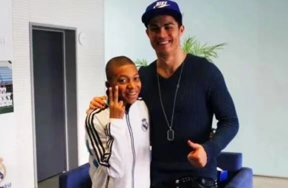

2006 年德国世界杯，第一次看世界杯，印象最深的还是阿根廷 6-0 塞黑，马拉多纳在现场激动地大喊，“梅西就是我的接班人！”C 罗也刚刚初出茅庐，我还在困惑怎么又是大罗又是小罗还有个 C 罗。一个个未来之星迭出，从内马尔到 J 罗，没人比姆巴佩更配赢。姆巴佩未来的身价完全值得巅峰梅西 + C 罗身价之和，一人扛着法国全队向冠军冲击。希望 2026 年能在美国现场观赛，到时候就不知道还能有几个让我从小如雷贯耳的球星还在了…

姆巴佩加油！

